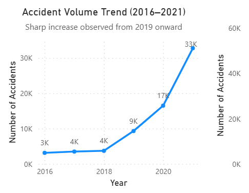
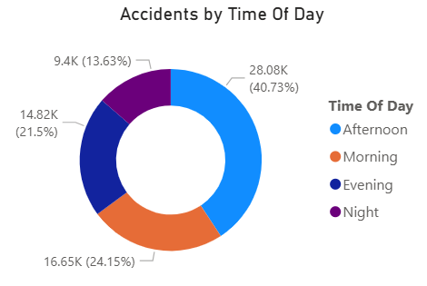
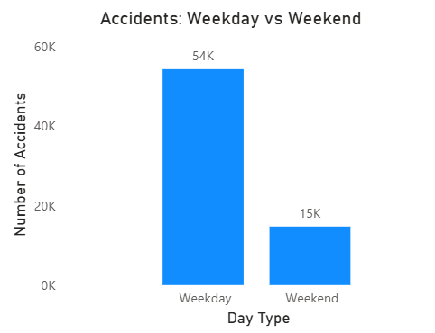
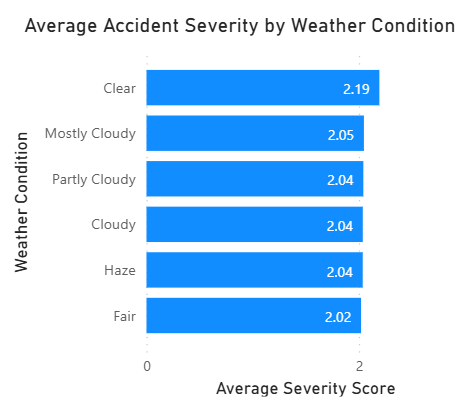
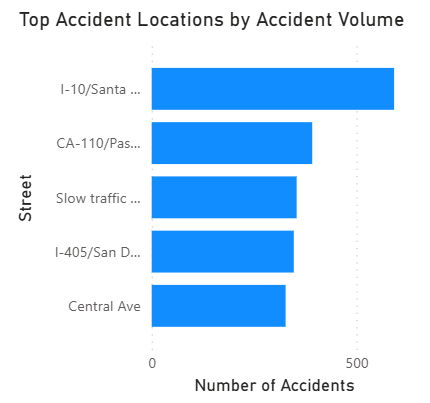
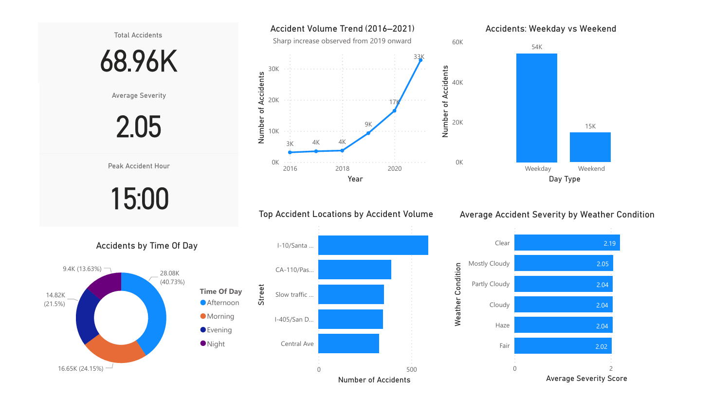

# Los Angeles Traffic Accident Intelligence  
Operational & Urban Risk Analysis Framework  
Big Blue Academy Datathon | 2025

---

## Executive Overview

This project analyzes 68,956 traffic accident records (2016–2021) to identify structural risk patterns across time, behavior, and environmental conditions.

Rather than descriptive reporting, the objective was to translate historical accident data into decision-support insights for:

- Traffic enforcement targeting
- Urban infrastructure planning
- Risk concentration monitoring
- Public safety optimization

All modeling and visualization were implemented in Power BI following structured data validation and transformation.

---

## Dataset Scope

- 68,956 accident records  
- March 2016 – December 2021  
- Source: Los Angeles Police Department (LAPD)  
- Data cleaned, validated, and modeled for analytical consistency  

Presentation reference:  
`presentation/datathon_presentation.pdf` :contentReference[oaicite:0]{index=0}

---

# Analytical Highlights

---

## 1️⃣ Long-Term Accident Trend



- Accident volume remained relatively stable (2016–2018)
- Significant structural increase observed from 2019 onward
- Suggests rising traffic density and infrastructure pressure

This shift marks a structural demand escalation, not seasonal noise.

---

## 2️⃣ Time-of-Day Risk Distribution



- Afternoon accounts for ~41% of total accidents
- Peak concentration around 15:00
- Morning and evening show similar but lower volumes

Risk concentration aligns strongly with commuting density patterns.

---

## 3️⃣ Weekday vs Weekend Volume



- ~79% of accidents occur on weekdays
- Weekend volume significantly lower
- Severity levels remain relatively stable across both segments

Volume — not severity — is the primary weekday risk driver.

---

## 4️⃣ Weather Impact on Severity



- Slightly higher average severity in clear and overcast conditions
- Rain and fog do not significantly increase severity scores
- Indicates behavioral factors dominate environmental impact

Weather is a secondary risk amplifier, not a primary driver.

---

## 5️⃣ High-Risk Locations



- Major highways and arterial corridors dominate accident concentration
- High-volume commuter routes show persistent risk clustering

Intervention prioritization should focus on high-density corridors.

---

## Executive Dashboard



The Power BI model consolidates:

- Total accidents: 68.96K  
- Average severity: 2.05  
- Peak accident hour: 15:00  
- Trend analysis  
- Departmental segmentation  
- Interactive filtering  

The dashboard architecture separates KPI logic from visualization, enabling scalable monitoring.

File:  
`powerbi/la_traffic_accidents_dashboard.pbix`

---

# Strategic Observations

- Traffic density and commuter behavior drive primary risk exposure.
- Afternoon weekday periods represent the highest operational vulnerability.
- Severity variance is relatively stable across time and weather conditions.
- Risk mitigation should target volume concentration, not just severity spikes.

---

# Data-Driven Recommendations

- Target enforcement during 15:00–18:00 peak window.
- Prioritize high-volume commuter corridors for intervention.
- Maintain safety controls in clear-weather conditions.
- Use longitudinal trend data for predictive traffic management planning.

---

# Project Architecture

```
la-traffic-accidents-datathon/
│
├── powerbi/
│   └── la_traffic_accidents_dashboard.pbix
│
├── images/
│   ├── dashboard_overview.png
│   ├── accidents_by_year.png
│   ├── accidents_by_time_of_day.png
│   ├── weekday_vs_weekend.png
│   ├── severity_by_weather.png
│   └── top_accident_locations.png
│
├── presentation/
│   └── datathon_presentation.pdf
│
└── README.md
```

---

# Technical Stack

- Power BI (Data Modeling, DAX, Dashboard Architecture)
- Excel (Initial data validation)
- Structured analytical storytelling

---

## Role & Contribution

Exploratory Data Analysis & Power BI Dashboard Design.

Contributed to:

- Data validation review
- KPI definition
- Insight framing
- Final presentation synthesis

---

## Professional Positioning

This project demonstrates:

- Risk concentration analysis
- Volume vs severity segmentation
- Time-series structural interpretation
- Executive-level dashboard delivery
- Urban operations intelligence

It reflects applied analytical reasoning in a public safety context — not isolated visualization.

---

Konstantinos Krasnostan  
Data Analyst | Operational Intelligence & Business Analytics

LinkedIn:  
https://www.linkedin.com/in/kon-kras/
